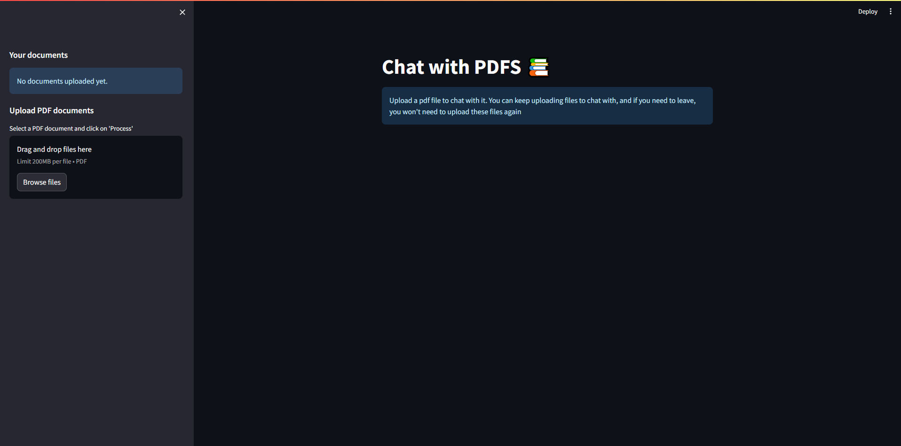
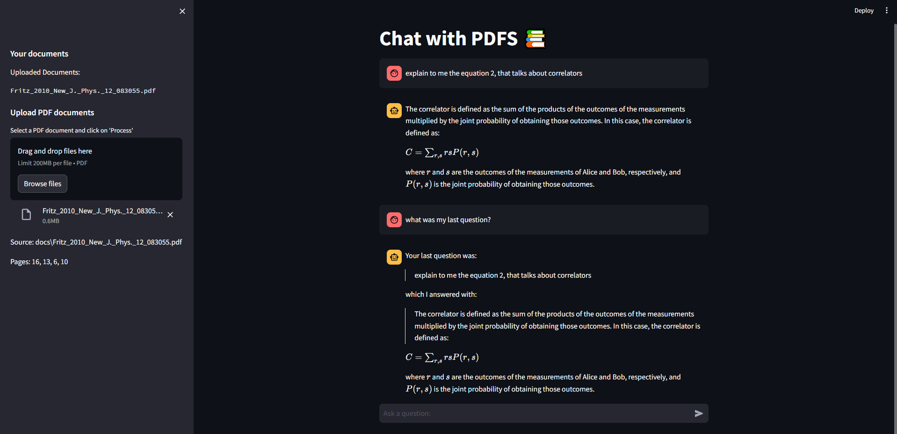
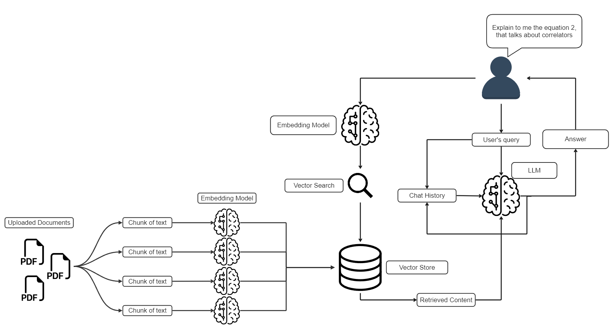

# CHAT-WITH-PDFS-RAG

A powerful Retrieval Augmented Generation (RAG) chatbot application that allows you to chat with your PDF documents using **Llama 3.3** (via Groq), LangChain, ChromaDB, and Streamlit.

Ask questions in natural language about your uploaded PDFs and get accurate, context-aware answers instantly!

This app uses **Groq's Llama-3.3-70b** model to generate accurate answers to your questions, ensuring privacy and speed by running embeddings locally.

---

## 📸 Interface Preview

### First Boot & Document Upload
The very first time the user launches the app, this will be the screen of the app. Note that the user cannot send any messages since there are no documents uploaded.



### In Usage: Chatting
The next time that the user launches the app, the chat box will be available and there will be a list of the uploaded documents. If the user tries to upload the same document again, the "process" button will not appear. When the user asks a question, the model will give a response based on the question, the content that was retrieved from the database, and the chat history. In the image below, we can see that the model is aware of the chat history, and that the source of the answer is displayed in the sidebar.



---

## 🚀 Features

-   **Chat with Multiple PDFs**: Upload multiple documents and chat with all of them simultaneously.
-   **RAG Architecture**: Uses advanced retrieval-augmented generation to ground answers in your document content.
-   **Local Embeddings**: Uses `all-MiniLM-L6-v2` (HuggingFace) for efficient and free local text embeddings.
-   **High-Performance LLM**: Powered by `llama-3.3-70b-versatile` via Groq for lightning-fast inference.
-   **Persistent Database**: Uses ChromaDB to save your document vectors locally, so you don't have to re-process files every time.
-   **Chat History**: Remembers the context of your conversation for a natural chat experience.
-   **Source Citations**: Shows exactly which source documents and pages were used to generate the answer.
-   **Clean UI**: A simple, elegant interface built with Streamlit.

---

## 🧠 How It Works



The main functionality of the app is the loop on the right side of the image. The user asks a question, the app searches for the best response in the database, and the content retrieved from the database is passed to the Large Language Model (LLM), which generates a response based on the question, chat history and content from the database. Here's a more detailed step-by-step of what happens:

1.  **Upload PDF**: If it's the very first time the app is launched, the user will need to upload a document to chat with. The app checks for a folder called "docs", and creates one if it doesn't exist. All PDF documents will be saved into this folder.
2.  **Text Chunking**: The app extracts the text from the PDF and separates it into chunks of text, with the size being measured by the limit of tokens the embedding model can handle per chunk.
3.  **Embedding and Saving**: These chunks of text pass through an embedding model (`all-MiniLM-L6-v2`), that generates vector representations of n dimensions of each text chunk. After that, all vectors are stored in a vector database. In this app, ChromaDB is being used, so that the vectordb is stored in disk, and the app creates a folder called "Vector_DB - Documents", to be the base folder of the database.
4.  **Similarity Matching**: When you ask a question, it is appended to the chat history. Also, the text that you used goes through the same embedding model that the chunks did, creating a vector representation of your question. With this, the app compares it with the text chunks and identifies the most semantically similar ones. It does this by using a distance metric, like the cosine similarity, which measures how close the angles between the vectors are. The closer the angles, the higher the similarity between the vectors.
5.  **Response Generation**: The selected chunks are passed to the language model (Llama-3.3 on Groq), which generates a response based on the relevant content of the PDFs, the user question and the chat history. When the LLM outputs the answer, it is appended to the chat history, so the model can use this to have context of the conversation itself, and not only of the documents, since the chat history is composed of users questions and the models answers.

---

## ⚙️ Installation & Setup

Follow these steps to set up the project locally.

### 1. Clone the Repository
```bash
git clone https://github.com/MADSKULL21/CHAT-WITH-PDFS-RAG.git
cd CHAT-WITH-PDFS-RAG
```

### 2. Create a Virtual Environment (Recommended)
It is highly recommended to use a virtual environment to manage dependencies.

**macOS/Linux:**
```bash
python3 -m venv .venv
source .venv/bin/activate
```

**Windows:**
```bash
python -m venv .venv
.venv\Scripts\activate
```

### 3. Install Dependencies
```bash
pip install -r requirements.txt
```

### 4. Set Up API Keys
You need a **Groq API Key** to run the LLM.

1.  Go to [Groq Console](https://console.groq.com/keys).
2.  Login and create a new API Key.
3.  Copy the API Key.

Create a `.env` file in the root directory of the project:

```bash
touch .env
```

Open `.env` and add your key:

```env
GROQ_API_KEY=gsk_your_actual_api_key_here
```

---

## 🚀 Usage

Once installed, you can start the application with a single command:

```bash
streamlit run app/app.py
```

The app will open automatically in your browser (usually at `http://localhost:8501`).

### How to Use
1.  **Upload**: Use the sidebar to browse and upload one or multiple PDF files.
2.  **Process**: The system will chunk and embed the text (this happens locally).
3.  **Chat**: Once processed, type your question in the chat input.
4.  **Inspect**: Check the sidebar to see which documents the AI is referencing.

---

## 📂 Project Structure

```
CHAT-WITH-PDFS-RAG/
├── app/
│   ├── app.py                  # Main Streamlit application
│   └── utils/
│       ├── chatbot.py          # Chat logic and LLM chain
│       ├── prepare_vectordb.py # PDF processing & Vector DB logic
│       ├── save_docs.py        # Helper to manage document uploads
│       └── session_state.py    # Streamlit session state management
├── docs/                       # Folder where uploaded PDFs are stored
├── Images/                     # Images for README
├── requirements.txt            # Python dependencies
├── .env                        # Environment variables (API Keys)
└── README.md                   # Documentation
```

## 🤝 Contributing

Contributions are welcome! Please feel free to submit a Pull Request.
